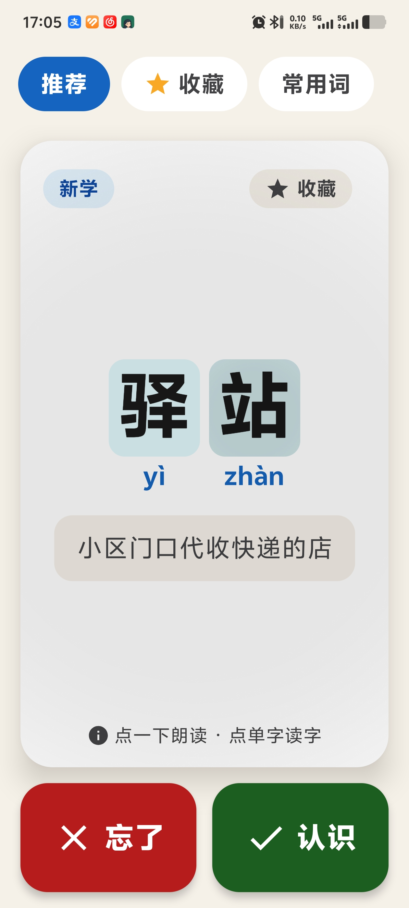
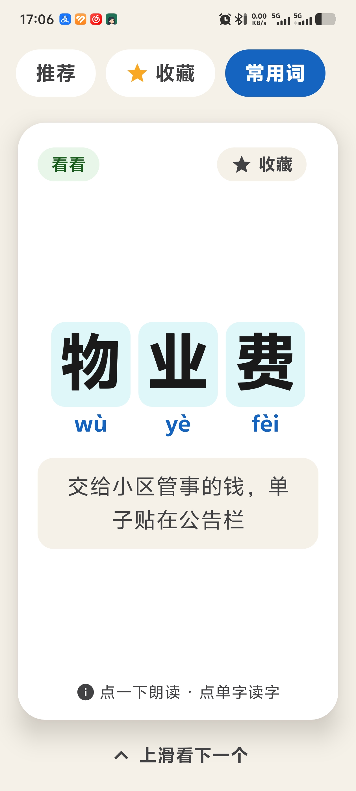
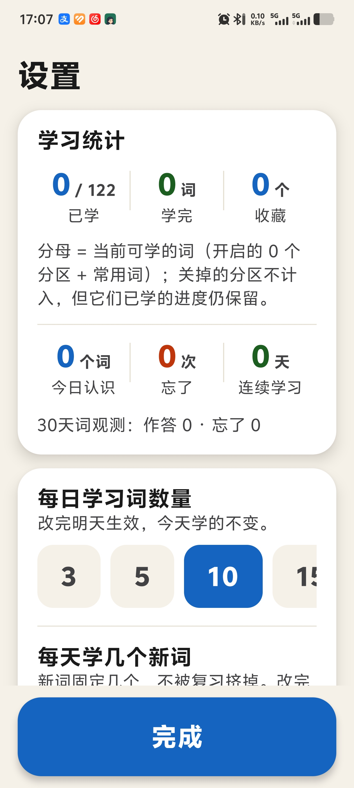

<div align="center">


# 认识么 KnowMo

**Learn life, one word at a time.** —— 学生活，从认一个字开始。

[](https://github.com/qiuyongjun/KnowMo/actions/workflows/android-build.yml)


[](LICENSE)

</div>

「认识么」是一款面向识字较少老年人的安卓识字辅助应用。它不做识字课本，而是把老人每天真实生活的场景搬进手机：地铁站、挂号处、快递驿站、手机微信——以**生活词组**为学习单元（如「地铁站」「取件码」），配合逐字拼音与用途说明，用老人最自然的姿势学习：**像刷短视频一样上下滑动**。

## 功能特性

- **抖音式滑动学习** —— 每屏一张词卡，上下滑动切换，卡片进入视口自动朗读，零学习成本
- **官方词库随仓库分发** —— `wordbanks/` 附 5 个 CSV 词库（公交地铁 / 医院 / 手机微信 / 家电 / 常用字词，共 460 条），传到手机导入即用；每词配逐字拼音与口语化用途说明，**可直接用 Excel 修改后重新导入**
- **自定义词库** —— 设置页导入 CSV 词库文件（Excel 填三列「词 / 拼音 / 用途」另存即可）即成一个新频道并自动显示（首次导入）；拼音列可空，App 自动注音；家属可为老人定制专属词库，删除词库不丢学习进度
- **记忆曲线复习** —— 内置 SM-2 变体调度算法：新学与到期复习卡自动混排，「认识」累计 3 次才提交跨日间隔，「忘了」清零重来，间隔随熟练度动态拉长（普通 30 / 成熟 60 天封顶）
- **场景频道切换** —— 顶部频道式 Tab，固定频道（推荐 / 收藏）+ 导入的场景分区，点按即换一批内容并语音播报
- **全程语音引导** —— Android 原生 TTS，语速固定 0.85x 适老偏慢，点单字读单字、点卡片重听词与用途
- **收藏与统计** —— 词卡一键收藏，隐藏设置页（连点「推荐」5 次唤出）提供学习统计、每日词量、分区显隐与拖动排序
- **适老化设计** —— 主字 ≥48sp、高对比配色（WCAG AAA）、反馈按钮 92dp、无多级菜单、无手势依赖，字号跟随系统缩放

## 应用截图

| 学习卡（推荐频道） | 浏览卡（分区浏览） | 隐藏设置页 |
|:---:|:---:|:---:|
|  |  |  |

*卡片进入视口自动朗读；点单字读单字，点卡片其余位置重听「词 + 用途」。*

## 下载安装

### 方式一：直接下载 APK（无需开发环境）

1. 打开 [Releases](https://github.com/qiuyongjun/KnowMo/releases) 页面
2. 下载最新版本附件中的 `app-release.apk`
3. 传到手机安装（需允许「安装未知来源应用」）

> 也可以从 [Actions · Android Debug APK](https://github.com/qiuyongjun/KnowMo/actions/workflows/android-build.yml) 的最新构建下载 artifact `knowmo-debug-apk`（每次推送到 main 自动构建）。

### 首次使用：导入词库（必做一步）

官方词库 CSV 已随 APK 打包（`wordbanks/` 内容与代码分离，App 首启动词库为空），两条路任选：

**一键导入（推荐）**

1. 打开 App → 空态引导页点「一键导入官方词库」（或在隐藏设置页 →「我的词库」→「一键导入官方词库」）
2. 回到学习界面即可开始

一键导入**只装还没装的库**，重复点不会覆盖家属改过的库；想刷新到官方最新内容，用设置页的「更新官方词库」（会覆盖已装的同名官方库，需二次确认）。

**手动导入（自定义 / 官方 CSV 均可）**

1. 在仓库 [`wordbanks/`](wordbanks/) 目录下载官方词库 CSV，或用 Excel 自制（三列：词 / 拼音 / 用途，拼音可空自动注音）
2. 传到手机 → 打开 App → 连点顶部「推荐」5 次 → 打开隐藏设置页
3. 「我的词库」→「导入词库文件」→ 起个名字导入；**想更新已装的库，导入时用同一个名字**（输入已装库名时对话框会提示将替换）
4. CSV 可用 Excel 修改（增删词、改用途说明）后按同名重新导入，学习进度保留

### 方式二：从源码构建

需要 Android Studio（Koala+）或 JDK 17 + Android SDK，详见 [`android-app/README.md`](android-app/README.md)。

## 目录结构

```
KnowMo/
├── wordbanks/             # 官方词库 CSV（公交地铁/医院/手机微信/家电/常用字词，导入即用可修改）
├── android-app/           # 安卓工程（Kotlin + Jetpack Compose，minSdk 26，零内置词库）
│   ├── app/src/main/java/com/knowmo/app/
│   │   ├── data/          # 数据模型、记忆调度与词库导入（词库内容在 wordbanks/）
│   │   ├── tts/           # TTS 语音播报封装
│   │   └── ui/            # 学习卡、频道、设置页等 Compose 界面
│   └── README.md          # 构建说明 + 交互契约（详细机制以此为准）
├── .github/workflows/     # CI：推送到 main 自动构建 Debug APK，打 tag 自动发 Release
└── icon.png               # 应用图标
```

## 技术要点

- **零第三方依赖**：仅 AndroidX + Jetpack Compose（`VerticalPager` 实现信息流），无网络、无权限申请、无数据上传
- **纯本地运行**：学习状态（词记忆状态 / 当日队列 / 统计）以 SharedPreferences + JSON 持久化，离线可用
- **记忆调度**：SM-2 变体——同日 3 次「认识」提交跨日间隔，`lapses`/`ease` 双指标驱动，到期词 ≥ 20 触发清债模式且新词配额保底
- **词库即数据**：官方词库以 CSV 随仓库分发（`wordbanks/`），内容与代码解耦——修词改 CSV 提 PR 即可；导入时逐字校验拼音配对，错误整库拒绝

完整的交互机制（防泄题、浏览池、会话快照等）见 [`android-app/README.md`](android-app/README.md) 的「交互契约」一节。

## 参与贡献

欢迎 Issue 与 PR——尤其是**词库修订**：发现拼音错误、提示语不易懂、缺少生活中常见词，直接改 [`wordbanks/`](wordbanks/) 下对应的 CSV 提 PR 即可（也可提 Issue 注明词组与所在分区）。App 会在导入时校验格式，改坏的 CSV 会被整库拒绝并给出原因。

构建与提交规范见 [`android-app/README.md`](android-app/README.md)。

## 许可证

本项目基于 [MIT License](LICENSE) 开源。
